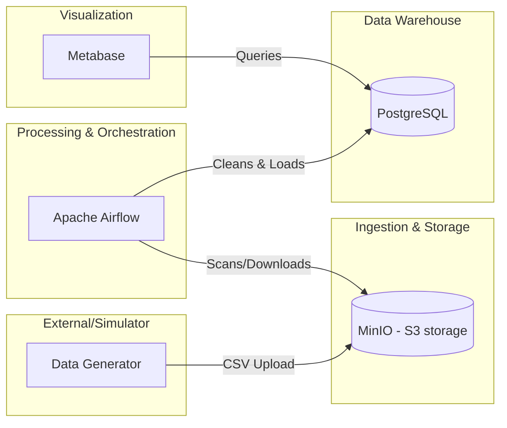
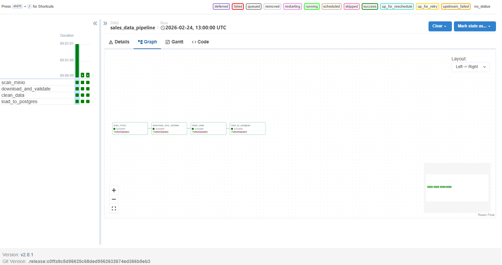
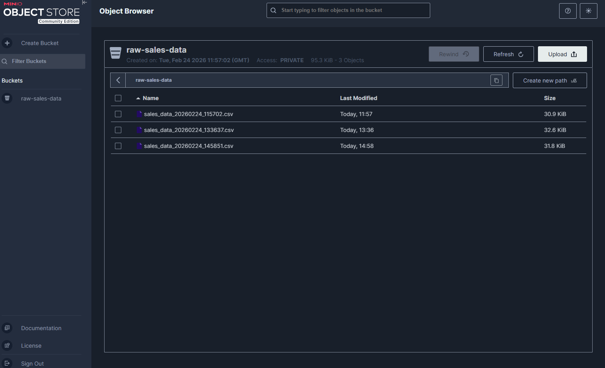

# Mini Data Platform (MDP) 

A robust, enterprise-ready "Mini" Data Platform built entirely on Docker Compose. This platform demonstrates the full data lifecycle: Collection, Processing, Storage, and Visualization.

## Architecture



## Key Features

- **Automated ETL**: Apache Airflow DAG handles scanning, schema validation, multi-stage cleaning (duplicates, bad types, anomalies), and idempotent loading.
- **MinIO Object Storage**: S3-compatible local storage for raw CSV ingestion.
- **Robustness**: 
    - **Retries**: 3x Exponential backoff on all tasks.
    - **Notifications**: Slack failure alerts (integrated via `.env` webhook).
    - **XCom Metrics**: Built-in monitoring showing row counts (clean vs dropped) directly in the Airflow UI.
- **Dashboarding**: Metabase comes pre-configured to query the `sales` table.
- **CI/CD**: GitHub Actions pipeline for building images and validating data flow.

## Quick Start

### 1. Prerequisites
- [Docker & Docker Compose](https://docs.docker.com/get-docker/)
- [Python 3.10+](https://www.python.org/downloads/)

### 2. Setup Environment
Clone the repo and create your `.env` (optional for Slack):
```bash
cp .env.example .env # If provided, or just create a new one
```

### 3. Spin up the Platform
```bash
docker compose up -d
```
*Wait ~1 minute for Airflow initialization.*

### 4. Access the Services
| Service | URL | Credentials (Default) |
|---------|-----|-------------|
| **Airflow** | [localhost:8081](http://localhost:8081) | `admin` / `admin` |
| **Metabase** | [localhost:3000](http://localhost:3000) | Setup on first visit |
| **MinIO** | [localhost:9001](http://localhost:9001) | `minioadmin` / `minioadmin123` |

### 5. Run the Data Pipeline
1.  **Generate Data**:
    ```bash
    pip install boto3
    python scripts/generate_sales_data.py
    ```
2.  **Trigger DAG**: Go to Airflow (localhost:8081), unpause `sales_data_pipeline`, and trigger it.

## Screenshots

Here are some snapshots of the platform in action:

| Airflow Pipeline Success | Metabase Dashboard |
|-------------------------|--------------------|
|  |  |

## Repository Structure
```text
.
├── airflow/            # Airflow DAGs and Logs
├── data/               # Local cache for raw and clean data
├── scripts/            # Simulation and Validation scripts
├── .github/workflows/  # CI/CD pipeline
├── Dockerfile          # Custom Airflow image with Slack support
└── docker-compose.yml  # Orchestration file
```

## Team Contributions
- **Team Member**: Mubarak Tijani
- **Role**: Full Stack Data Engineer
- **Tasks**: Architecture Design, Airflow DAG Development, Docker Orchestration, Slack Integration.

## Assessment Checklist
- [x] **Does it run?**: Yes, fully containerized.
- [x] **Data flow validation?**: Yes, verified MinIO -> Airflow -> Postgres.
- [x] **Dashboards?**: Yes, Metabase connected to SQL warehouse.
- [x] **CI/CD?**: GitHub Actions implemented.
