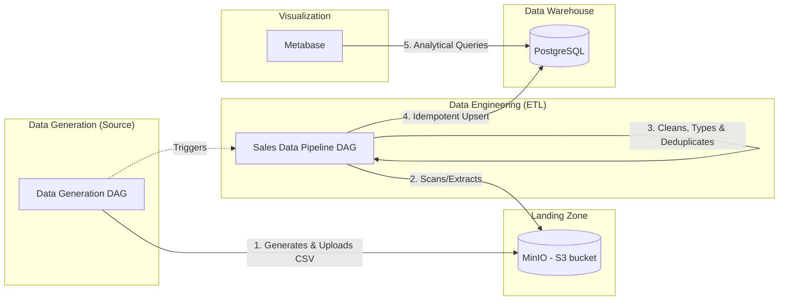

# ConnectSphere - Mini Data Platform (MDP)

A robust, enterprise-ready "Mini" Data Platform built entirely on Docker Compose. This platform demonstrates a realistic, decoupled data lifecycle: Generation (Simulating a source system), Collection (Object Storage), Processing (ETL Orchestration), Storage (Data Warehouse), and Visualization.

## Architecture & Data Flow



## Key Architectural Decisions

- **Decoupled Architecture**: Data generation and data processing are managed by two completely distinct Airflow DAGs (`data_generation_dag` and `sales_data_pipeline`). The generator simulates an external application producing data daily, and it automatically triggers the downstream ETL pipeline when done.
- **In-Memory Generation**: The generator (`data_generation_dag.py`) builds the fake sales CSVs entirely in-memory using `io.StringIO` and streams them securely into the MinIO bucket, acting as a true stateless microservice.
- **Idempotent ETL**: The main pipeline utilizes `ON CONFLICT (transaction_id) DO NOTHING` during insertion. You can safely trigger the pipeline 100 times against the identical MinIO bucket, and exactly zero duplicate rows will be created in your Postgres data warehouse.
- **Data Quality Logic**: Real data is dirty. The generator intentionally injects localized anomalies (missing names, strings inside numeric columns like "5 units", or negative totals) into ~10% of the rows. The ETL pipeline strictly validates the schema `download_and_validate`, rigorously cleanses bad rows using `pandas`, and coerces strict data types (`clean_data`) before it touches PostgreSQL.
- **Observability**: Built-in Slack alerting on failure handles active monitoring, while Airflow XComs natively track "Total rows", "Dropped Rows", and "Successfully Inserted rows" for every single file parsed.

## Quick Start

### 1. Prerequisites
- Docker & Docker Compose
- Python 3.10+ (for local testing/development)

### 2. Setup Environment
Clone the repo and configure your environment (Optional: add a Slack Webhook):
```bash
cp .env.example .env 
```

### 3. Spin up the Platform
```bash
docker compose up -d
```
*Wait ~60 seconds for Airflow to boot and Postgres to initialize the `salesdb`.*

### 4. Access the Services
| Service | URL | Default Credentials |
|---------|-----|-------------|
| **Airflow** | [localhost:8081](http://localhost:8081) | `admin` / `admin` |
| **Metabase** | [localhost:3000](http://localhost:3000) | Setup on first visit |
| **MinIO** | [localhost:9001](http://localhost:9001) | `minioadmin` / `minioadmin123` |

### 5. Running the Complete Lifecycle
1. Navigate to **Airflow** (`http://localhost:8081`).
2. Log in and **unpause** both DAGs (`data_generation_dag` and `sales_data_pipeline`).
3. Click **Trigger DAG** on `data_generation_dag`.
4. Watch it generate data, upload to MinIO, and seamlessly **trigger** the `sales_data_pipeline` right behind it.
5. In your terminal, verify the records landed safely in the warehouse:
   ```bash
   docker exec mdp_postgres psql -U airflow -d salesdb -c "SELECT COUNT(*) FROM sales;"
   ```

## Repository Structure
```text
.
├── airflow/
│   └── dags/
│       ├── data_generation_dag.py   # Simulates external app producing data
│       └── sales_data_pipeline.py   # Core Data Engineering ETL pipeline
├── tests/                           # Pytest unit tests mocking Airflow and S3
├── .github/ workflows/ci-cd.yml     # Automated Tests and Docker Build checks
├── Dockerfile                       # Custom Airflow image (Pandas, Boto3, Postgres, Slack)
└── docker-compose.yml               # Complete infrastructure definitions
```

## Testing & CI/CD
This repository enforces high code-quality standards via rigorous automated testing.
Run unit tests locally to verify DAG logics:
```bash
PYTHONPATH=. pytest tests/ -v
```
All code pushed to `main` executes the `.github/workflows/ci-cd.yml` pipeline ensuring the Python logic, infrastructure syntax, and Docker builds seamlessly complete before deployment.
